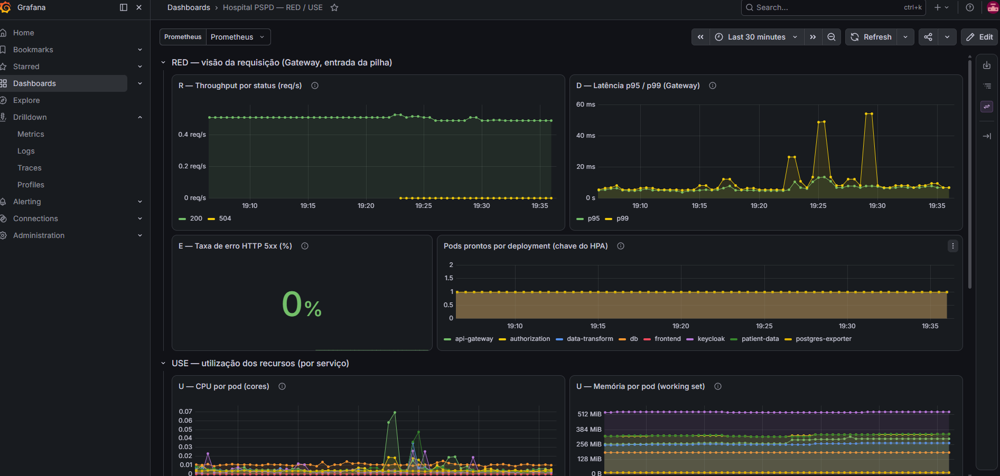
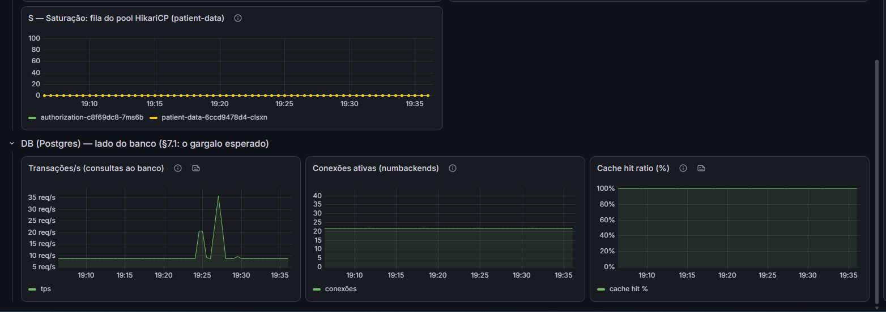

# Dashboard RED/USE (fase e — observabilidade)

> Dashboard versionado em `k8s/observability/dashboards/red-use.json`, importado no Grafana do
> kube-prometheus-stack por `make dashboard` (ConfigMap com label `grafana_dashboard: "1"` → sidecar).
> Organizado em **RED** (por serviço) + **USE** (por recurso), com latência em **P95/P99**, não média
> (Arundel & Domingus, cap. 16).

## Subir

```bash
make cluster && make deploy      # Prometheus (kps) + serviços raspados pelo servicemonitor
make dashboard                   # importa o JSON
make grafana                     # Dashboards → "Hospital PSPD — RED / USE"
```

## Painéis (7) e as 6 métricas

| Painel | Grupo | PromQL (resumo) | Fonte |
|---|---|---|---|
| Throughput por status | **R** | `rate(http_server_requests_seconds_count{application="api-gateway"}[1m])` by status | Micrometer (Gateway) |
| Latência p95/p99 | **D** | `histogram_quantile(0.95\|0.99, …http_server_requests_seconds_bucket…)` | Micrometer |
| Taxa de erro 5xx % | **E** | 5xx / total | Micrometer |
| Pods prontos por deployment | HPA | `kube_deployment_status_replicas_ready{namespace="default"}` | kube-state-metrics |
| CPU por pod | **U** | `rate(container_cpu_usage_seconds_total{namespace="default"}[1m])` | cAdvisor |
| Memória por pod | **U** | `container_memory_working_set_bytes{namespace="default"}` | cAdvisor |
| Saturação pool HikariCP | **S** (USE) | `hikaricp_connections_pending{namespace="default"}` | Micrometer (patient-data) |

> As três primeiras cobrem RED da **entrada** (Gateway HTTP). USE por pod cobre os 4 serviços + o
> Postgres via cAdvisor (independe de métrica de app). "Pods prontos" liga o painel ao HPA. A fila do
> HikariCP é o sinal de saturação que denuncia o gargalo do banco (§7.1).

## Evidência

Dashboard **"Hospital PSPD — RED / USE"** capturado no Grafana do kube-prometheus-stack
(2026-07-12, com tráfego passando):





Os resumos do k6 por cenário/nível (throughput, latência média/p95, erro) estão em
`imagens/k6_*.{png,jpeg}` e `imagens/hpa*.png`; os summaries brutos em `loadtest/out/`.

## Leitura para o relatório

Cumpre o requisito da fase (e): observabilidade com método (RED + USE, P95/P99). O valor aparece sob
carga — cruzar, no mesmo eixo temporal: throughput (R) subindo até o platô, p95 (D) no "joelho", CPU
(U) batendo o alvo de 60% do HPA, pods-ready subindo em resposta, e a fila do HikariCP crescendo
quando o Postgres satura. Com o **Loki** (logs, `loki-logql.md`) e o **Tempo** (traces,
`tracing-tempo.md`) no mesmo Grafana, a mesma janela temporal correlaciona métrica ↔ log ↔ trace.
