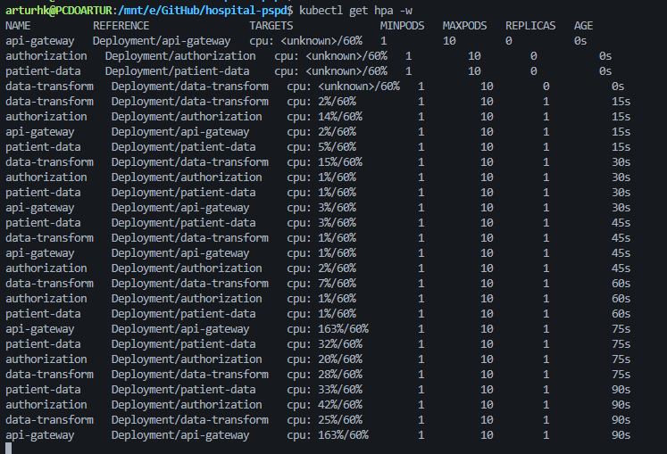
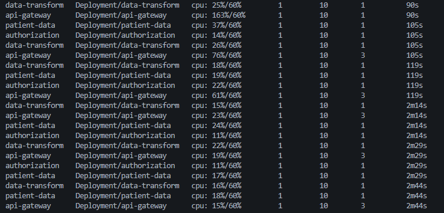

# Escalabilidade, HPA e balanceamento gRPC (fases c e d)

> Rodado no cluster kind `pspd` (1 control-plane + 3 workers). Capturas de **2026-07-10** (§1 DNS,
> §3 distribuição de pods, §4 `kubectl get hpa`, §6 smoke) e **2026-07-13** (HPA sob carga k6:
> `get hpa -w` + `hpa-timeline.csv`). Análise consolidada: `docs/RELATORIO.md` §6–§7 e §9.

---

## 0. Pré-condição

O toggle depende do `application.yml` novo estar **dentro da imagem**. `kubectl set env` sozinho não
basta se a imagem carrega o `application.yml` antigo.

```bash
make images && make deploy
```

---

## 1. Causa-raiz do §7.3 — o DNS devolve 1 IP virtual

A afirmação a provar: um `Service` ClusterIP resolve para **um** endereço; o headless resolve para
**um por pod**. É isso, e só isso, que impede o `round_robin` de funcionar.

```bash
make scale N=3

# ClusterIP → 1 IP virtual (o do Service, não o dos pods)
kubectl run dns --rm -it --restart=Never --image=busybox:1.36 -- \
  nslookup patient-data.default.svc.cluster.local

# headless → 3 registros A, um por pod
kubectl run dns --rm -it --restart=Never --image=busybox:1.36 -- \
  nslookup patient-data-headless.default.svc.cluster.local
```

**RESULTADO** _(capturado 2026-07-10, cluster `pspd`, `scale N=3`)_:

```
# ClusterIP → 1 endereço (o IP virtual do Service)
$ nslookup patient-data.default.svc.cluster.local
Server:    10.96.0.10
Address:   10.96.0.10:53
Name:   patient-data.default.svc.cluster.local
Address: 10.96.33.124

# headless → 3 registros A, um por pod (subnets .1/.2/.3 = 3 workers distintos)
$ nslookup patient-data-headless.default.svc.cluster.local
Server:    10.96.0.10
Address:   10.96.0.10:53
Name:   patient-data-headless.default.svc.cluster.local
Address: 10.244.2.8
Name:   patient-data-headless.default.svc.cluster.local
Address: 10.244.3.8
Name:   patient-data-headless.default.svc.cluster.local
Address: 10.244.1.6
```

> Confirma a tese: ClusterIP devolve **1** endereço, headless devolve **3**. Os 3 IPs headless caem
> em subnets de nós diferentes — a distribuição por worker é a mesma vista em §3.

> **Leitura para o relatório.** O `net.devh:grpc-client-spring-boot-starter:3.1.0.RELEASE` já usa
> `round_robin` como `defaultLoadBalancingPolicy` — verificável em `GrpcChannelProperties`. Ele faz
> round-robin **sobre a lista de endereços que o resolver DNS devolveu**. Com ClusterIP essa lista
> tem um elemento. Somado a isso, o gRPC abre **uma** conexão HTTP/2 de longa duração e multiplexa
> todos os streams nela, enquanto o `kube-proxy` só balanceia no estabelecimento da conexão. Logo:
> 3 réplicas, 1 pod trabalhando. O diagnóstico inicial do grupo (“falta setar `round_robin`”)
> estava incorreto; o fix é o `clusterIP: None`.

---

## 2. §7.3 — antes × depois, com carga

Uma variável muda por vez. Mesmo `SCALE` do seed, mesmo nº de VUs, mesmo tempo de rampa.

```bash
# ── ANTES: ClusterIP + pick_first
make grpc-lb-off && make hpa-off && make scale N=3
#   ... bateria k6 ...
kubectl top pods -l app=patient-data

# ── DEPOIS: headless + round_robin
make grpc-lb-on && make hpa-off && make scale N=3
#   ... mesma bateria ...
kubectl top pods -l app=patient-data
```

_O cenário `3replicas-off` não foi executado nesta rodada de medição; a prova da causa-raiz é o
`nslookup` do §1 (1 endereço × 3 endereços). Os resultados medidos do cenário `3replicas-on`
(10/50/100 VUs) estão em `loadtest/out/` e na tabela do `docs/RELATORIO.md` §5._

> Se o ganho de `off`→`on` for pequeno, **não é falha do fix**: é o Postgres saturando (§7.1). Nesse
> caso a evidência do balanceamento é o `kubectl top pods`, não o throughput.

---

## 3. Fase (c) — distribuição dos pods entre os 3 workers

Exigido pelo enunciado §3(c): *"a utilização dos nós do cluster, a distribuição dos pods do K8S"*.

Os 4 Deployments declaram `topologySpreadConstraints` (`maxSkew: 1`, `topologyKey:
kubernetes.io/hostname`, `whenUnsatisfiable: ScheduleAnyway`). Sem isso o default do scheduler é
`maxSkew: 3` e 3 réplicas poderiam cair 2/1/0. É *soft* de propósito: com o HPA indo a 10 réplicas,
um `DoNotSchedule` deixaria pods em `Pending` ao lotar o nó, e `Pending` sob carga contamina a fase (d).

```bash
make scale N=3
make pods-wide          # kubectl get pods -o wide
kubectl top nodes
```

**RESULTADO** _(capturado 2026-07-10, `scale N=3`)_ — cada Deployment de 3 réplicas ficou com
**1 pod por worker** (`maxSkew: 1` satisfeito, zero empilhamento):

```
$ kubectl get pods -o wide
NAME                              READY   STATUS    IP            NODE
api-gateway-7fb9775498-c4f7q      1/1     Running   10.244.3.11   pspd-worker2
api-gateway-7fb9775498-ntgsv      1/1     Running   10.244.1.13   pspd-worker
api-gateway-7fb9775498-vqwf7      1/1     Running   10.244.2.10   pspd-worker3
authorization-5dcbbd67d7-69rs9    1/1     Running   10.244.2.9    pspd-worker3
authorization-5dcbbd67d7-8kqn8    1/1     Running   10.244.3.7    pspd-worker2
authorization-5dcbbd67d7-nwlp9    1/1     Running   10.244.1.5    pspd-worker
data-transform-67bb67485f-6lx22   1/1     Running   10.244.1.8    pspd-worker
data-transform-67bb67485f-6twmf   1/1     Running   10.244.2.4    pspd-worker3
data-transform-67bb67485f-pzjpg   1/1     Running   10.244.3.9    pspd-worker2
patient-data-6655bd44d5-5gjjc     1/1     Running   10.244.2.8    pspd-worker3
patient-data-6655bd44d5-lmxxf     1/1     Running   10.244.1.6    pspd-worker
patient-data-6655bd44d5-q5mz9     1/1     Running   10.244.3.8    pspd-worker2

$ kubectl top nodes
NAME                 CPU(cores)   CPU(%)   MEMORY(bytes)   MEMORY(%)
pspd-control-plane   100m         0%       901Mi           11%
pspd-worker          60m          0%       1111Mi          14%
pspd-worker2         65m          0%       1535Mi          20%
pspd-worker3         97m          0%       1774Mi          23%
```

> Distribuição ideal: os 4 serviços têm exatamente 1 réplica em cada um dos 3 workers. Uso de nós
> baixo (idle, sem carga) — a assinatura sob carga está no §4b (`hpa-timeline.csv`).

---

## 4. Fase (d) — HPA

Exigido pelo enunciado §3(d): demonstrar *"(i) criação automática de pods, (ii) redistribuição da
carga, (iii) redução de latência, (iv) limites de escalabilidade"*.

```bash
make grpc-lb-on && make scale N=1 && make hpa-on
kubectl get hpa                 # o portão exige `<n>%/60%`, NÃO `<unknown>/60%`
kubectl get hpa -w              # sob carga: TARGETS sobe, REPLICAS sobe
kubectl get pods -w             # tempo até Ready de cada pod novo
```

**RESULTADO — `kubectl get hpa`** _(capturado 2026-07-10, ~64 s após `make hpa-on`)_ — `TARGETS`
mostra `%/60%` real, **não** `<unknown>`, provando que o `requests.cpu: 250m` está sendo lido:

```
$ kubectl get hpa     # imediatamente após criar (métricas ainda populando)
NAME             REFERENCE                   TARGETS              MINPODS   MAXPODS   REPLICAS
api-gateway      Deployment/api-gateway      cpu: <unknown>/60%   1         10        0
authorization    Deployment/authorization    cpu: <unknown>/60%   1         10        0
data-transform   Deployment/data-transform   cpu: <unknown>/60%   1         10        0
patient-data     Deployment/patient-data     cpu: <unknown>/60%   1         10        0

$ sleep 60 && kubectl get hpa     # metrics-server populou
NAME             REFERENCE                   TARGETS       MINPODS   MAXPODS   REPLICAS   AGE
api-gateway      Deployment/api-gateway      cpu: 2%/60%   1         10        3          64s
authorization    Deployment/authorization    cpu: 1%/60%   1         10        3          64s
data-transform   Deployment/data-transform   cpu: 1%/60%   1         10        3          64s
patient-data     Deployment/patient-data     cpu: 1%/60%   1         10        3          64s
```

> O `<unknown>` inicial é o `metrics-server` ainda populando (~60 s), não erro de config. CPU baixa
> (idle, sem carga). `REPLICAS 3` herdado do `scale N=3` anterior — o HPA não faz scale-down imediato.

> `<unknown>/60%` significa `metrics-server` ainda populando (aguardar ~60 s) ou `resources.requests.cpu`
> ausente. Os 4 Deployments já têm `requests: { cpu: "250m" }`.

**RESULTADO — `get hpa -w` durante a bateria k6** _(capturado 2026-07-13, cenário `hpa`)_ — o
requisito §3(d.i) do enunciado, **criação automática de pods**, ao vivo: o `api-gateway` estoura o
alvo (`cpu: 163%/60%`) e o HPA sobe `REPLICAS` de 1 → 3; os demais serviços seguem abaixo do alvo e
ficam em 1 réplica:





### 4b. Série temporal (pods × tempo) — o gráfico-assinatura da fase (d)

`kubectl get hpa -w` gera texto, não dado. Para o gráfico *nº de pods × tempo
sobreposto à carga* é preciso amostrar. Rodar **em background, antes** de disparar a rampa:

```bash
make watch-hpa SCENARIO=hpa &
#   ... rampa k6 até 1000 VUs ...
kill %1
```

Gera `docs/evidencias/hpa-timeline.csv` com
`ts_utc,elapsed_s,scenario,deployment,replicas,ready,cpu_pct,desired`. Rodadas de cenários
diferentes acumulam no mesmo arquivo, distinguidas pela coluna `scenario` — o `loadtest/plot.py`
filtra por ela.

Vale rodar **também** nos cenários de réplica fixa: o CSV então prova que a contagem **não** variou
durante a bateria (`replicas` constante, `cpu_pct` vazio), o que valida "mesmas condições de teste"
exigido pelo enunciado.

**RESULTADO — `hpa-timeline.csv`** _(capturado 2026-07-13, cenário `hpa`, 652 amostras/~15 min;
arquivo inteiro versionado nesta pasta)_:

```
ts_utc,elapsed_s,scenario,deployment,replicas,ready,cpu_pct,desired
2026-07-13T00:41:02Z,0,hpa,api-gateway,3,3,,
2026-07-13T00:41:02Z,0,hpa,authorization,3,3,,
...
2026-07-13T00:55:34Z,872,hpa,authorization,1,1,1,1
2026-07-13T00:55:34Z,872,hpa,patient-data,1,1,1,1
2026-07-13T00:55:34Z,872,hpa,data-transform,1,1,1,1
```

> Repare na coluna `ready` × `replicas`: a distância entre as duas é o **cold-start da JVM** (§7.2).
> Um pod contado em `replicas` mas ausente de `ready` está subindo e não atende ninguém.

---

## 5. §7.2 — HPA × cold-start da JVM (e a defasagem de DNS)

Dois efeitos somados atrasam o alívio que o HPA deveria dar. Medir **os dois**, separados:

1. **Cold-start da JVM.** Do `Scheduled` ao `Ready` de um pod novo. Esperado 20–40 s.
2. **Defasagem de re-resolução DNS.** Do pod ficar `Ready` até o gateway realmente mandar tráfego para
   ele. Encadeia: EndpointSlice atualiza → registro A do Service headless muda → cache de
   `InetAddress` da JVM expira → o `DnsNameResolver` do grpc-java re-resolve (ele **não** re-resolve
   periodicamente em background; só sob churn de subchannel).

Mitigação aplicada no `k8s/base/api-gateway.yaml`:

```yaml
- name: JAVA_TOOL_OPTIONS
  value: "-Dsun.net.inetaddr.ttl=5 -Dsun.net.inetaddr.negative.ttl=0"
```

> ⚠️ **Armadilha que vale o parágrafo no relatório:** `-Dnetworkaddress.cache.ttl` **não tem efeito**.
> É uma *security property*, lida de `$JAVA_HOME/conf/security/java.security`, não uma system property.
> A equivalente configurável por `-D` é `sun.net.inetaddr.ttl`.

```bash
# tempo até Ready dos pods criados pelo HPA
kubectl get events --sort-by=.lastTimestamp | grep -E 'Scheduled|Started|Ready'
# latência p95 no mesmo eixo temporal (painel RED do Grafana)
```

**RESULTADO** — o efeito aparece no `hpa-timeline.csv` (§4b): a distância entre as colunas
`replicas` e `ready` de cada amostra é o cold-start (pod contado em `replicas` mas ausente de
`ready` está subindo e não atende ninguém). O resumo k6 do cenário `hpa` está em
`imagens/hpa10vh.png` / `hpa50vh*.png` e nos summaries `loadtest/out/hpa_vus*.json`.

> **Leitura para o relatório.** O autoscaling não é gratuito nem instantâneo. Sob rampa rápida, a
> latência piora antes de melhorar: os pods novos consomem CPU do nó para subir a JVM enquanto ainda
> não atendem, e mesmo depois de `Ready` levam mais alguns segundos para entrar na rotação do cliente
> gRPC. É o argumento a favor de `minReplicas` folgado ou de *pre-scaling* antes de picos previstos —
> exatamente o que Arundel & Domingus (cap. 16) chamam de automatizar a ação, mas com histerese.

---

## 6. Reprodutibilidade

```bash
make demo DEMO_FRESH=1      # cluster do zero → deploy → seed → smoke das 3 jornadas
```

**RESULTADO** _(capturado 2026-07-10, `make demo` com seed SCALE=5000)_:

```
=== RESUMO ===
  patients                 : 5,000
  encounters               : 20,086
  clinical_events          : 139,803
  user_patient_assignments : 5,200
  projects                 : 50

>> smoke das 3 jornadas (port-forward efêmero em 8081/9001)
  OK  medico/FULL        -> Patient no Bundle FHIR
  OK  pesquisador/AGG    -> MeasureReport (sem dado individual)
  OK  medico sem vínculo -> DENY (403)
```

> Nesta rodada foi `make demo` (cluster já de pé); `DEMO_FRESH=1` recria o cluster do zero.
> Pré-requisito: o smoke usa `jq` (`apt-get install -y jq` na WSL).
