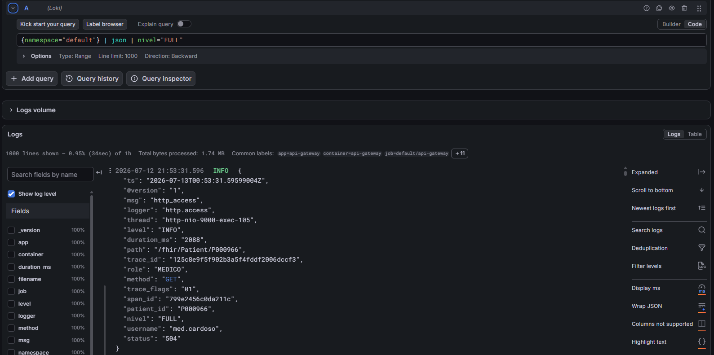
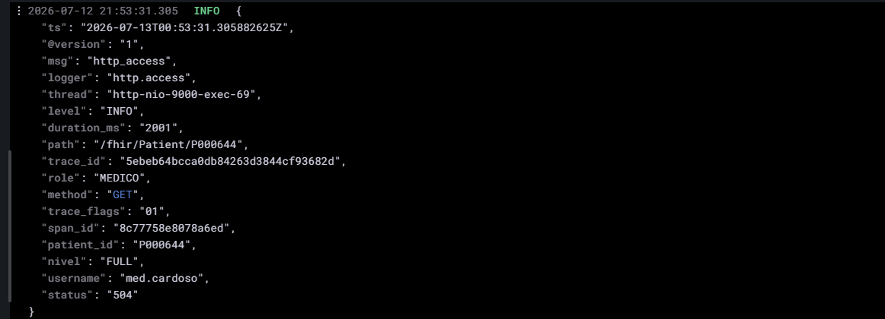

# Loki — logs agregados e consultáveis (bônus, §6 observabilidade)

> Loki + Promtail via `make loki` (chart `grafana/loki-stack` na namespace `monitoring`). Promtail
> (DaemonSet, 1 pod/nó) coleta o stdout de todos os pods → Loki. O datasource é auto-registrado no
> Grafana do kube-prometheus-stack (`k8s/observability/loki-datasource.yaml`, label
> `grafana_datasource: "1"`). **Empilha no logging JSON** (`docs/evidencias/logging-json.md`): como o
> Gateway já emite JSON, o `| json` do LogQL expõe cada campo como filtro, sem regex.

## Subir

```bash
make cluster && make deploy      # kps + serviços já de pé
make loki                        # Loki + Promtail + datasource
make grafana                     # abre o Grafana; Explore → datasource "Loki"
```

## Consultas (Grafana → Explore → Loki)

```logql
# Toda a trilha de acesso do namespace da aplicação
{namespace="default"} | json

# Auditoria: o que cada perfil recebeu (nível servido)
{namespace="default", pod=~"api-gateway.*"} | json | nivel="FULL"
{namespace="default"} | json | nivel="PARTIAL"

# Rate limiting em ação (429) e recurso inexistente (404)
{namespace="default"} | json | status="429"
{namespace="default"} | json | status="404"

# Trilha por usuário e latência alta
{namespace="default"} | json | username="med.cardoso"
{namespace="default"} | json | duration_ms > 1000
```

## Evidência

Grafana → Explore → Loki (2026-07-12), consulta `{namespace="default"} | json | nivel="FULL"`
retornando as linhas `http_access` do Gateway com os campos JSON expostos como filtros:



Linha expandida — todos os campos de auditoria, incluindo `trace_id`/`span_id` (injetados pelo OTel
agent), que permitem o salto log↔trace:



## Leitura para o relatório

Fecha o triângulo de observabilidade no mesmo Grafana: **métricas** (Prometheus, RED/USE),
**logs** (Loki, auditoria por `username`/`nivel`) e **traces** (Tempo, ver `tracing-tempo.md`).
O valor está na correlação: um pico de `duration_ms` no log cruza com a latência p95 do Prometheus e
com o trace da requisição lenta (mesmo `trace_id`). Decisão consciente: **não** promover campos de alta
cardinalidade (`patient_id`, `username`) a *labels* do Loki — eles ficam no corpo JSON e são
filtrados por `| json`, evitando explosão de séries (má prática que o Loki penaliza).
