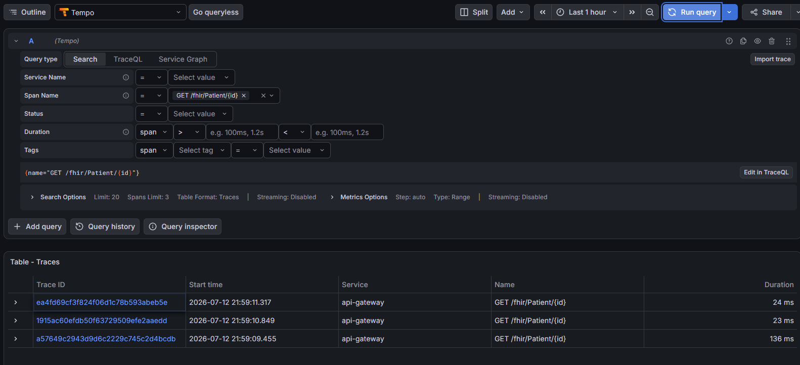
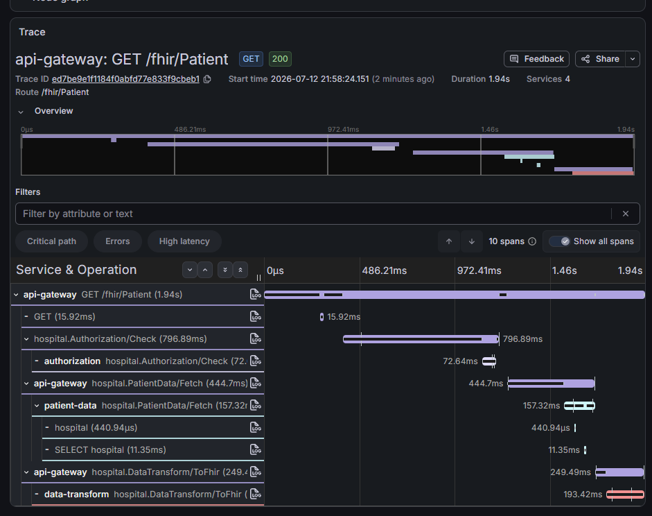
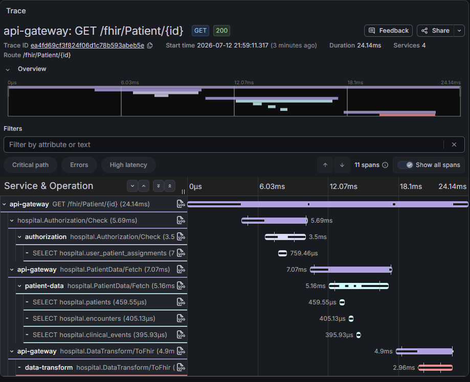

# Tracing distribuído — OpenTelemetry + Tempo (bônus, §6)

> Fecha o triângulo de observabilidade no mesmo Grafana: **métricas** (Prometheus/RED-USE), **logs**
> (Loki) e **traces** (Tempo). Instrumentação por **OTel Java agent** (auto, zero código):
> auto-instrumenta Spring MVC, gRPC (cliente+servidor) e JDBC → o trace atravessa
> `api-gateway (HTTP) → authorization (gRPC) → patient-data (gRPC) → SELECT (JDBC) → data-transform (gRPC)`.

## Modelo de toggle (por que OFF por default)

O agent está **embutido nas 4 imagens** (`services/*/Dockerfile`, via `-javaagent` no ENTRYPOINT),
mas **inerte por default** (`OTEL_SDK_DISABLED=true`). Motivo: exportar spans a 100% adiciona overhead
e contaminaria as fases b/c/d. `make tracing` liga; `make tracing-off` desliga; `run-load-tests.sh`
força OFF antes de cada bateria. Mesmo princípio dos toggles `grpc-lb` e rate limiting.

## Subir e ligar

```bash
make redeploy          # imagens novas COM o agent embutido
make loki              # (recomendado) p/ o salto trace→log funcionar
make tracing           # Tempo + datasource + liga o export nos 4 serviços
make demo              # gera tráfego → traces
make grafana           # Explore → datasource "Tempo" → Search
```

## O que observar

- **Trace multi-serviço:** um trace único com os spans dos 4 serviços + o span do `SELECT` no
  Postgres (instrumentação JDBC). Mostra a latência de cada salto — onde o tempo é gasto.
- **Salto trace→log:** no span, botão **"Logs for this span"** → consulta o Loki filtrando por
  `trace_id` → a linha `http_access` daquela requisição. O `trace_id` vem do MDC que o agent injeta
  e o `AccessLogFilter` já emite em JSON (nenhuma mudança de código foi necessária).
- **Service graph / node graph:** o Tempo deriva o mapa de dependência entre serviços dos spans.

## Sampling

Ligado = **100%** (`parentbased_always_on`) — ideal para debug (nunca perde o request). Para simular
produção sem rebuild: `kubectl set env deploy/<svc> OTEL_TRACES_SAMPLER=parentbased_traceidratio
OTEL_TRACES_SAMPLER_ARG=0.1`. Estratégias de produção (para o relatório): head ratio (1–10%,
parent-based), rate-limiting (teto N/s), tail sampling (erros+lentos sempre, via OTel Collector).

## Evidência

Capturado 2026-07-12, tracing ligado (`make tracing`) com tráfego real. Busca de traces no Tempo
(Grafana → Explore → Tempo → Search):



Trace multi-serviço aberto — os spans atravessam
`api-gateway → hospital.Authorization/Check → hospital.PatientData/Fetch → SELECT (JDBC) → hospital.DataTransform/ToFhir`,
4 serviços num único trace, com o tempo de cada salto:





O salto **trace→log** usa o mesmo `trace_id` que aparece na linha `http_access` do Loki — ver
`loki-logql.md` (imagem da linha expandida com `trace_id`/`span_id`).

## Nota de método (§7.2)

Com o agent sempre carregado, o cold-start absoluto de um pod inclui ~1 s de inicialização do agent —
**constante** entre pods e rodadas, então não afeta *comparações* de escala/HPA. O tracing só
**exporta** quando ligado; nas baterias medidas ele está OFF.
